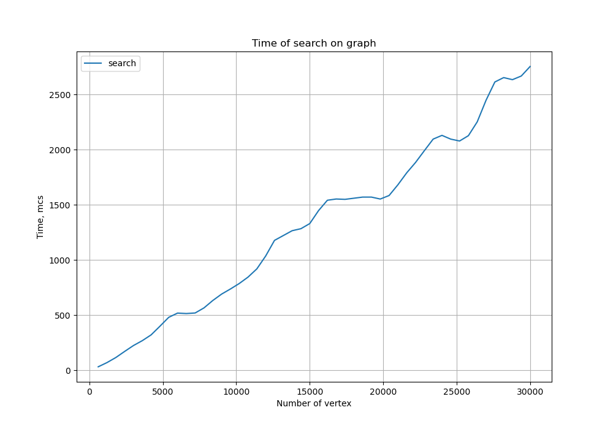

# Графы
Неориентированный граф - 6\
Поиск путей - 5\
Поиск путей на большом графе - 8\
Генерация графов - 10\
Материализация графа - 3\
Использование алгоритма динамического программирования - 10\
Сумма: 44

График зависимости времени работы поиска пути от количества вершин в графе:

